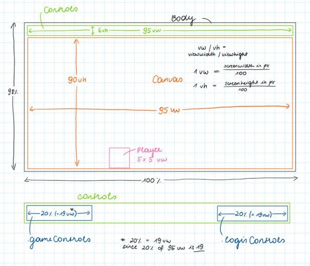
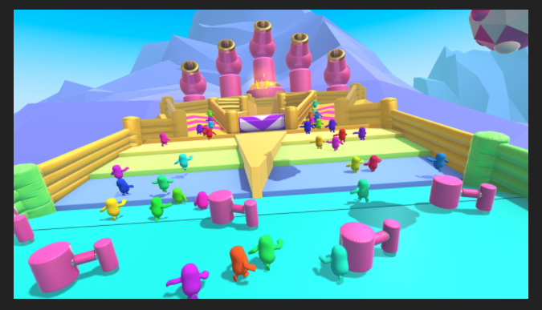
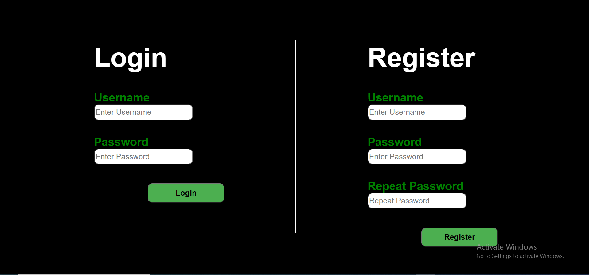
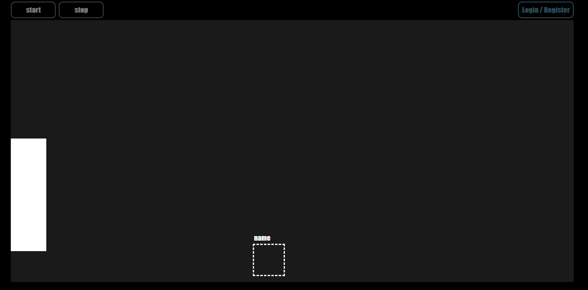

# Web Programming - Drop Guys

## Content

- [Contributors](#contributors)
- [Style and Code standards](#style-and-code-standards)
- [Progress / Documentation](#progress-and-documentation)

## Contributors
[Akshay Venkataramana](https://github.com/Ya2001)  
[Áron Széles](https://github.com/szelesaron)  
[Laura Schauer](https://github.com/lascha212)

## Style and Code standards

naming convention: underscore  

CSS width & height for future reference  

## Progress and Documentation

### 2020-09-20

- came up with name for the game: "Drop Guys"
- first draft

 
 
 

### 2020-09-21

Goals for next meeting:  
- have a basic GUI with:  
  - Akshay: players that can move sideways  
  - Laura: obstacles that "move downwards" (-> looks like players are moving through the game)  
- Áron: LogIn

**general style of game:**  

 
 
 

### 2020-09-27

Finished the front-end of the login/signup page. (Áron) #10F75D
    
 
 
 

### 2020-09-28  

Goals for next meeting:   
- Áron: backend & security for login  
- Akshay: use @keyframes for player movement (avoid using canvas)  
- Laura: design world & obstacles  
- next meeting: compile all the code
 
 
 

### 2020-11-16

###### Client:  
- character can be moved by arrowkeys  
- using a gameLoop() to control the game  
- obstacle creation: one obstacle that shows up on the screen over and over again in different size & position 
- collision detection: detects if player hits the obstacle  

Current Design: 

 
 

###### Game Flow:  
Functions:  
- gameLoop() : calls update(), draw(); loops while gameIsOn=true
- update() : calls detectCollision(), changes position of player (=> updates variables) 
- draw() : draws the characters position onto the canvas (=> updates graphics) 

If gameIsOn = false then:  
- animationFrame is cancelled
- stop() : puts character back to starting position, removes animation class from obstacle, stops collision detection  

- detectCollision() : if collision detected 0> gameIsOn = false
